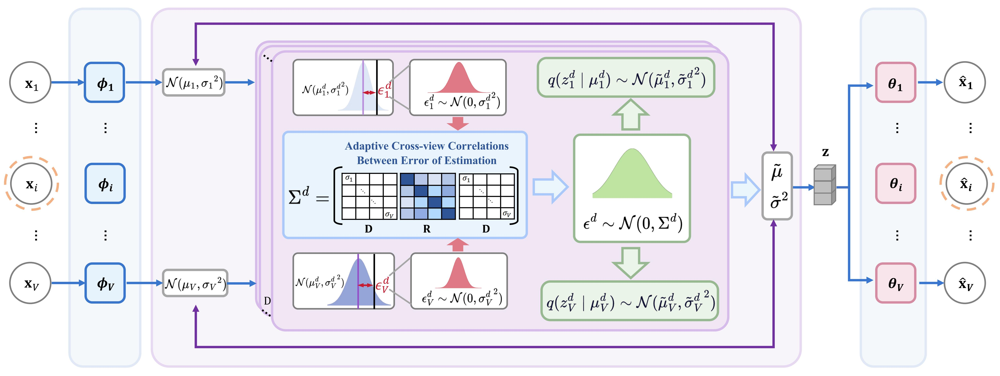

# Beyond Independence: Learning Correlated Views for Variational Incomplete Multi-View Clustering

An official source code for the ICML 2026 paper *Beyond Independence: Learning Correlated Views for Variational Incomplete Multi-View Clustering*. ACOVA is primarily designed for incomplete multi-view clustering and explicitly models cross-view correlations during latent aggregation; it is also applicable to complete multi-view clustering scenarios. If you have any issues or questions, please contact [zhemingxu96@gmail.com](mailto:zhemingxu96@gmail.com). If you find this repository helpful for your research or work, we would greatly appreciate a star⭐.


## Overview
Incomplete multi-view clustering (IMVC) aims to uncover shared cluster structures from data with partially observed views. Although recent imputation-free methods based on variational inference demonstrate robustness to missing views, they commonly rely on a conditional independence assumption across views in the posterior aggregation stage, which fails to capture the inherently structured and potentially correlated nature of multi-view data. In this paper, we propose a variational framework that explicitly goes beyond this assumption by introducing a learnable cross-view correlation structure. Specifically, we explicitly model and learn correlations between views by utilizing the covariance structure of posterior estimation errors during aggregation. To facilitate robust and efficient learning, the correlation matrix is parameterized through a normalized Cholesky decomposition, ensuring positive definiteness and enabling the entire model to be trained jointly through a unified variational objective. Extensive experiments on multiple IMVC benchmarks demonstrate that our method consistently outperforms state-of-the-art approaches across a wide range of missing-view settings. These results highlight the effectiveness of adaptive correlation modeling in variational IMVC, demonstrating the need to go beyond the independence assumption in IMVC.



## Installation


```bash
conda create -n acova_repro python=3.8.20 -y
conda activate acova_repro
```

Install dependencies:

```bash
pip install -r requirements.txt
```

where 
```bash
numpy==1.24.3
scipy==1.10.1
scikit-learn==1.3.0
matplotlib==3.7.5
tensorboard==2.14.0
torch==2.4.1
```

## Data Preparation
https://pan.baidu.com/s/1JSyKZ8g4Lmwsq0H9xgYsRw code: n94n 

If you want to use your own incomplete-view masks, replace the mask generation (`get_mask`) with file-based loading via `load_mask(filepath)` in `datasets.py`.


## Quick Start

```bash
python main.py
```
You can configure the CUDA device in `config.py`

## Citation

If you find this repository useful, please cite:

```bibtex
@inproceedings{ACOVA,
title={Beyond Independence: Learning Correlated Views for Variational Incomplete Multi-View Clustering},
author={Xu, Zheming and Tang, Aiyue and Chen, Shidi and Zou, Xuechao and Lang, Congyan and Mancisidor, Rogelio A and Kampffmeyer, Michael},
booktitle={Forty-third International Conference on Machine Learning},
year={2026}
}
```
